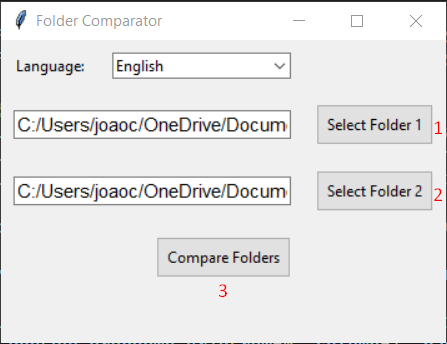
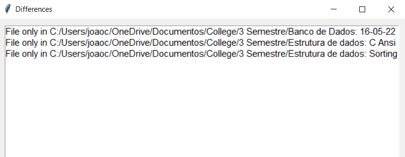

# Folder comparer

This project has a very simple reason to exist.

I needed to look inside over 50 folders and get the different files and subfolders inside of it.
I was too lazy to search any software that could do this for me so I did one for myself in only 20 minutes.

Also, I added portuguese lang since I'm brazilian and some friend of me might use it.

---

## So, how it works?

It's actually very simple.

You select your folder 1 and folder 2. Then press compare folders.

The differences should open a new little window telling you where that specific folder/file is in each folder that you selected.

